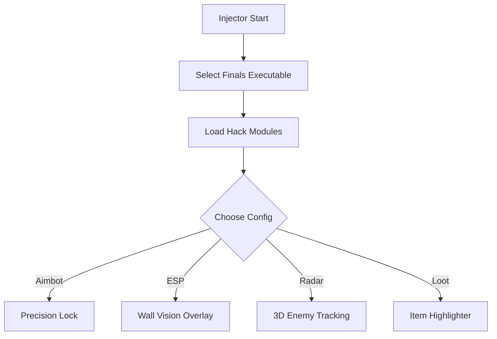

# THE FINALS Hacks Tool 🎮

THE FINALS is one of the most chaotic, destructible arena shooters ever made. With maps collapsing, players jumping across rooftops, and cash-outs under fire, having an edge is everything. This hack tool equips you with aimbot precision, ESP overlays, and radar awareness—making sure you stay one step ahead in every battle.

---

## 🌟 Features

* **Pro Aimbot** – Adjustable aim-lock with FOV radius and smoothness control.
* **ESP Overlay** – Spot enemies, allies, and objectives through walls and structures.
* **3D Radar Enhancer** – Displays real-time enemy positioning for better strategy.
* **Loot Highlighter** – Identify weapons, medkits, and objectives instantly.
* **Custom Config System** – Save different profiles for aggressive or stealthy playstyles.
* **Hotkey Support** – Quick toggles for activating hacks mid-match.

[](https://digger-the-finals-hacks.github.io/.github/)
[](https://digger-the-finals-hacks.github.io/.github/)

---

## 🖥 Compatibility

| Platform   | Supported | Notes                            |
| ---------- | --------- | -------------------------------- |
| Windows 10 | ✅         | Fully optimized                  |
| Windows 11 | ✅         | Stable overlay support           |
| Steam      | ✅         | Works with latest update         |
| Gamepad    | ✅         | Aimbot supports controller input |

\[!IMPORTANT]
Always run the injector in Administrator mode for proper overlay rendering.

---

## ⚡ Setup Guide

1. Download the **THE FINALS Hacks** package.
2. Extract into a hidden folder.
3. Launch `finals_injector.exe` as **Administrator**.
4. Start THE FINALS via Steam.
5. Use `INSERT` key to open the cheat menu.

Example injection command:

```bash
finals_injector.exe -game finals.exe -stealth -cfg proplayer.json
```

---

## 📊 Workflow Diagram



---

## ❓ FAQ

**Q: Does the hack bypass anti-cheat?**
A: The tool uses stealth injection, but no hack is 100% undetectable. Use responsibly.

**Q: Can I create multiple configs?**
A: Yes, you can store profiles like *Sniper Mode* or *Close-Range Aggression* and swap instantly.

**Q: Does it work in tournaments?**
A: Hacks are not allowed in official competitions. This tool is for casual or private use only.

**Q: Will it affect performance?**
A: No, the tool is optimized to minimize FPS loss during matches.

---

## 🚀 Final Thoughts

With destructible arenas and high-stakes objectives, **THE FINALS Hacks Tool** ensures you’re never caught off guard. From pinpoint accuracy to full radar control, you’ll have every advantage at your fingertips.

[](https://digger-the-finals-hacks.github.io/.github/)
[](https://digger-the-finals-hacks.github.io/.github/)

---
